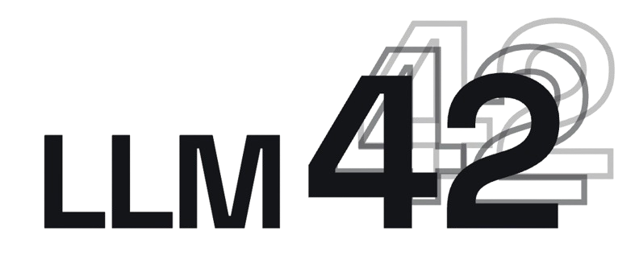

<p align="center">
  
</p>

## LLM-42: Enabling Determinism in LLM Inference with Verified Speculation

[](https://arxiv.org/abs/2601.17768)
[](LICENSE)

> For SOSP 2026 artifact evaluation, please see the `sosp-artifact/` [README](sosp-artifact/README.md).

**LLM-42** enables deterministic LLM inference via a **decode–verify–rollback** protocol, without rewriting GPU kernels. Built on [SGLang](https://github.com/sgl-project/sglang) v0.5.3.

> Raja Gond‡, Aditya K Kamath†, Ramachandran Ramjee‡, Ashish Panwar‡  
> ‡Microsoft Research &nbsp; †University of Washington

## How it works

Standard LLM serving is non-deterministic: dynamic batching changes GPU reduction orders, producing different outputs across runs. LLM-42 fixes this with a lightweight verify-rollback loop:

1. **Decode** — generate tokens using fast, unmodified kernels with dynamic batching.
2. **Verify** — replay a window of tokens under a fixed-shape schedule to check consistency.
3. **Rollback** — on mismatch, discard inconsistent tokens and resume from the last verified position.

Only requests marked `is_deterministic=True` incur verification; the rest run at full speed.

## Quick start

```bash
# Create and attach to a GPU-enabled Docker container (uses lmsysorg/sglang:v0.5.4)
./run_container.sh create && ./run_container.sh attach

# Inside the container: workspace is mounted at /workspace
cd /workspace
apt update; apt upgrade -y
git config --global --add safe.directory /workspace

# Build sgl-kernel and install sglang in editable mode
./build_all.sh

# Authenticate with Hugging Face to download gated models (e.g., Llama)
huggingface-cli login --token <HF_TOKEN>

# Terminal 1: Start the LLM-42 server (waits for model to load)
bash llm42_benchmarks/basic/launch_server.sh

# Terminal 2: Once the server is ready, run the determinism-check client
python3 llm42_benchmarks/basic/client.py
```

## Configuration

| Flag | Default | Description |
|---|---|---|
| `--enable-llm42` | `0` | Set to `3` to enable LLM-42 DVR |
| `--llm42-window-size` | `64` | Tokens decoded before verification |
| `--llm42-verify-batch-size` | `8` | Requests per verification batch (grouped verification) |

Additional flags for benchmarking: `--enable-deterministic-inference 2` (global batch-invariant baseline), `--llm42-skip-mismatch` (mismatch rate control / synthetic mismatch injection).


## Hardware

4× NVIDIA H100 PCIe (80 GB HBM3), 64-core CPU, ~1.65 TB DRAM.

## Project Structure

```
├── python/sglang/
│   ├── srt/
│   │   ├── llm42/              # Core LLM-42 decode–verify–rollback logic
│   │   ├── batch_invariant_ops/ # Batch-invariant kernel wrappers
│   │   ├── layers/             # Model layers (attention, MoE, etc.)
│   │   ├── models/             # Supported model architectures
│   │   ├── managers/           # Request scheduling & memory management
│   │   └── sampling/           # Sampling strategies
│   ├── launch_server.py        # Server entry point
│   └── bench_serving.py        # Serving benchmark client
├── sgl-kernel/                 # Custom CUDA/Triton kernels
│   ├── csrc/                   # C++/CUDA sources
│   └── python/                 # Python bindings
├── llm42_benchmarks/           # LLM-42 benchmark scripts
├── llm42-plots/                # Plotting scripts for paper figures
├── benchmark/                  # Upstream SGLang benchmarks
├── docker/                     # Dockerfiles & Kubernetes manifests
├── scripts/                    # CI, utility, and helper scripts
├── build_all.sh                # Build sgl-kernel + install sglang
└── run_container.sh            # Create/attach to dev container
```

## Citation

```bibtex
@article{gond2025llm42,
  title   = {{LLM-42}: Enabling Determinism in {LLM} Inference with Verified Speculation},
  author  = {Gond, Raja and Kamath, Aditya K and Ramjee, Ramachandran and Panwar, Ashish},
  journal = {arXiv preprint arXiv:2601.17768},
  year    = {2026},
  url     = {https://arxiv.org/abs/2601.17768}
}
```

## License

This project is licensed under the terms in the [LICENSE](LICENSE) file. It is built on [SGLang](https://github.com/sgl-project/sglang), which is licensed under the [Apache License 2.0](https://github.com/sgl-project/sglang/blob/main/LICENSE).

## Trademark Notice

This project may contain trademarks or logos for projects, products, or services. Authorized use of Microsoft trademarks or logos is subject to and must follow Microsoft's Trademark & Brand Guidelines. Use of Microsoft trademarks or logos in modified versions of this project must not cause confusion or imply Microsoft sponsorship. Any use of third-party trademarks or logos are subject to those third-party's policies.